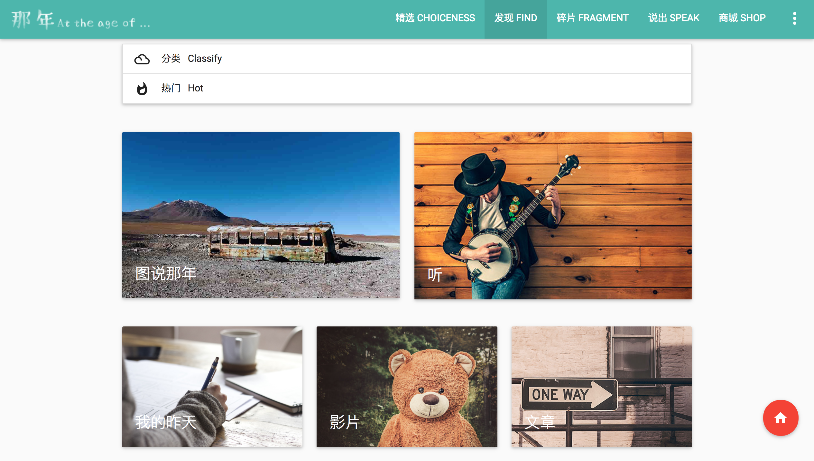

那年
======================

项目介绍
======================

一个怀旧类阅读平台,发布怀旧文章、音乐、影片,提供回忆交流的平台

使用技术
======================

**前端**

+ UI框架: Materialize

+ Javascript库: jQuery

**后端**

+ Web MVC框架: ThinkPHP3.1

+ 数据库: MySQL

起步
======================

1. 下载并安装MySQL,创建数据库名字为goforremember,导入Public/goforremember.sql

2. 下载并安装Apache服务器

3. 启动Apache服务器,在浏览器输入url地址: localhost/goforremember 登录系统

4. 普通用户的账号名为root,密码为root;管理员用户的账号名为root,密码为root

功能介绍
======================

该系统分为前台主站和后台管理两大部分

### 前台主站

+ 用户需要注册账号后使用账号登录该系统,不登录则无法使用本系统

+ 精选 CHOICENESS: 提供每日一图、历史上的今天、精选文章发布等内容

+ 发现 FIND: 分为图说那年、听、我的昨天、影片、文章板块;提供怀旧文章、音乐、影片,编写日记等功能

+ 碎片 FRAGMENT: 为用户提供短文字发布和展示的平台,具有防恶意灌水和敏感词过滤等功能

+ 说出 SPEAK: 用户交流论坛,用户可以发布帖子以及对感兴趣的内容进行评论

### 后台管理

+ 管理员的后台入口为网站首页页脚最下方的"Administrator entrance"按钮

+ 管理员可以通过后台对前台所有版块进行管理

+ 后台管理所有删除操作都可以在对应的注销版块进行恢复和永久删除

* * * * * * * * * *

该网站有三个主题,分别为男生主题,女生主题与那年极简版,分别对应40岁以下男性、40岁以下女性以及40岁以上中年人;男生版的主题为青绿色、女生版的主题为玫瑰粉、极简版将会大大降低操作复杂度,所有的字体也会同等放大

功能截图
======================

### 前台主站

+ 网站首页

+ 登录页面

+ 发现板块

+ 发现照片

+ 女生主题

+ 极简版

### 后台管理

+ 管理员登录

+ 后台管理页面

